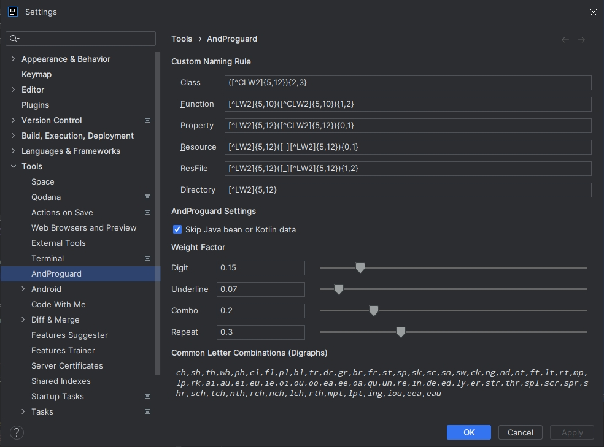

## 自定义命名规则

### 设置项：（Settings -> Tools -> AndProguard）

- **Custom Naming Rule**：***自定义命名规则***，支持自定义类名，方法名，变量属性名，资源名，文件名等等命名规则。
- **Skip Java bean or Kotlin data**：***是否跳过数据类***，勾选则执行任务时跳过 `Java` 中的 `getter`或`setter` 方法和对应的字段，
  以及 `Kotlin` 中的 `Data` 类的构造方法内的成员参数。
- **Weight Factor**：***权重因子***，定义数字/下划线/组合以及重复字符出现的概率，最小值0表示不出现，值越大则出现频率越高。
- **Common Letter Combinations**：***常用字母组合***，当匹配到命名规则 `W2` 时，会从给定组合中挑选并以一定概率插入字符串中

### 1. 命名 `[]`：特定标识确定随机字符的选取范围和规则

`^` 首位标识，用来触发以下命名规则，无 `^` 标识开头则表示是一个固定字符串。  
`C/S` 标识大/小驼峰（首字母大/小写），仅单个出现生效，`C/S` 同时出现或同时没有则表示不需要驼峰。  
`U/L/I` 标识大/小写字母，Upper 大写，Lower 小写，Ignore 大小写都有，`U/L/I` 都没有表示不需要字母。  
`D` 标识数字，`D` 没有表示不需要数字。  
`_` 标识下划线，`_` 没有表示不需要下划线。  
`W1/W2` 标识假单词，让生成随机字符串更像单词，W1元辅音交替，W2在W1基础上增加常用组合，`W1/W2` 没有表示不需要模仿单词。

***简单示例：***

> - `[CLD_W1]` 表示大驼峰即首字母大写，其余位置由小写字母，数字，下划线组成，同时添加假单词规则
> - `[LW2]` 表示由小写字母组成的单词，添加假单词规则

### 2. 范围 `{}`：随机字符或组合的重复次数

没有限定范围时，默认表示仅出现1次  
`{start, end}` 表示闭区间内的随机次数  
`{length}` 表示固定次数

### 3. 子集合 `()`：表示嵌套的命名规则

`([^CLW2]{5,12}){2,3}` 表示2至3个伪单词，伪单词由大驼峰，小写字母组合，同时添加假单词规则，伪单词长度为5至12

### 4. 命名规则示例

> - `[^U][^L]{3,9}` 表示大写字母开头，后接3至9位小写字母
> - `([CLD_W1]{5,12}){1,2}[Activity]` 表示1至2个大驼峰假单词，后接固定字符串 `Activity`
> - `[^LW2]{5,12}([_][^LW2]{5,12}){1,2}` 表示2至3个纯小写字母组成的单词，单词之间由下划线 `_` 连接

### 5. 注意事项

- 填写自定义命名规则务必保证符合命名规范，否则替换名字将会不执行或出现不可预知的错误。
- 子集合`()`不宜嵌套过深，会影响执行效率。