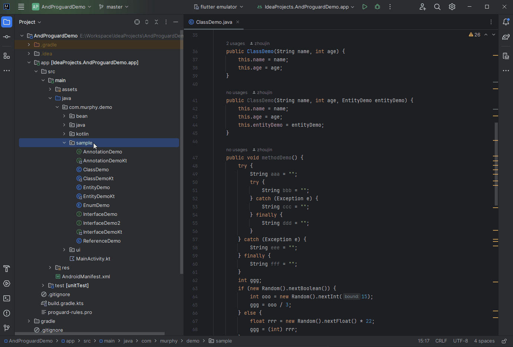
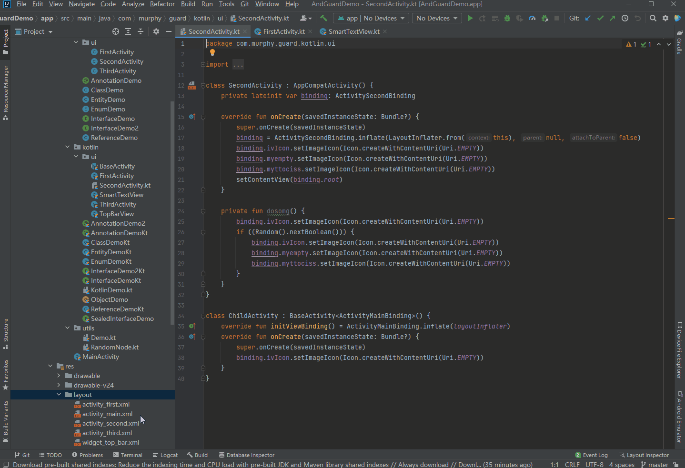
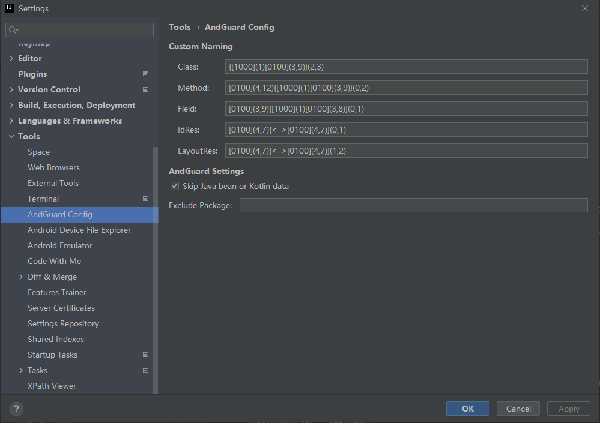

[](https://kotlinlang.org/)
[](https://plugins.jetbrains.com/plugin/23840-andproguard)
[](https://plugins.jetbrains.com/plugin/23840-andproguard)

*Read this in other languages: **[English](README.md)**, [简体中文](README.zh.md).*

[Install from Plugin Marketplace](https://plugins.jetbrains.com/plugin/23840-andproguard)

## About AndProguard

- AndProguard is a plugin that helps obfuscate source files, supports multiple languages `Java/Kotlin/Xml`,
  and supports batch obfuscation.
- AndProguard performs renaming by looking for all elements that can be modified, including: class names,
  file names, method/function names, field/property names, parameter names, and local variable names in `Java/Kotlin`,
  attribute names and file names in `Xml`.
- Its principle is based on the renaming function of the official plugin, which automatically handles all referenced
  changes when modifying a `psiElement`; AndProguard is an extension of this functionality.

> #### What can AndProguard do?
>- Application hardening, Increase the difficulty of aab and apk decompilation.
>- Reduce the duplication rate of aab packages, Avoid excessive similarity detection, which may lead to application
   remove from the `Google Play` or account suspension.

### Warning⚠️

- **AndProguard operates locally, and task execution is irreversible, so be sure to back up your code or operate
  under version branch tool management, otherwise the code will be difficult to restore.**
- **Renaming will be associated with invalid references in the `build` directory,
  so be sure to clean the `build` directory before execution: execute `Build-Clean Project`,
  otherwise a dialog that blocks the task will appear.**

### Easy use

Just select the files or folders you want to obfuscate, then select `AndProguard` or `ViewBinding` from
the right-click menu:




- `AndProguard` supports working with `Java/Kotlin/Xml` files or folders.
- `ViewBinding` only supports the use of `Xml` files or folders, and the `ViewBinding` reference will be
  automatically processed when modifying `Xml`.

### Settings



- **[Custom naming](#custom-naming)**：Supports custom naming rules for class names, method names, variable names, etc.
- Exclude package：Fill the package name. Use the symbol `;` to connect multiple package names.
  The filled-in directory will be ignored when performing tasks on the folder.
- Skip data：When executing tasks, the `getter` or `setter` methods and corresponding fields in `Java` will be skipped,
  as well as the member parameters in the constructor of the `Data` class in `Kotlin`.

### Custom naming

#### 1 Mark []：Four-digit identifier determines the range of random characters

| [ |      0 \| 1      |      0 \| 1      | 0 \| 1 |  0 \| 1   | ] |
|---|:----------------:|:----------------:|:------:|:---------:|---|
| * | uppercase letter | lowercase letter | digit  | underline | * |
| * |       A-Z        |       a-z        |  0-9   |     _     | * |

#### 2 Length ()：Number of repetitions of random characters or combinations

Closed interval representation `(start, end)` or fixed length representation `(length)`

#### 3 Simple example：

`[1000](1)[0100](3,9)` (large camelcase pseudo-word) means starting with an uppercase letter,
followed by 3 to 9 lowercase letters

#### 4 Reuse combination {}：

`{[1000](1)[0100](3,9)}(2,3)` Represents 2 to 3 large camelcase pseudo-words

#### 5 Fixed string <>：

`{[1000](1)[0100](3,9)}(1,2)<Activity>` Represents 1 to 2 large camelcase pseudo-words, followed by `Activity`

### Note

- AndProguard does not invade the packaging process and cannot obfuscate the compiled `Class` file.
  It needs to be executed before packaging.
- The custom naming rules must comply with the naming standards,
  otherwise the name replacement will not be executed or unpredictable errors will occur.
- Reuse rules `{}` should not be nested too deeply as it will affect execution efficiency.

### Usage example

```
>>>>>>>>>>>>>>>>>>>>>>>>>>>>>> 2024-02-26 10:36:06 [Refactor Start] <<<<<<<<<<<<<<<<<<<<<<<<<<<<<<
============================== FirstActivity.java ==============================
[Parameter] savedInstanceState >>> zzsgywjb
[Variable] tvConxx >>> nezKgxdj
[Class] FirstActivity >>> UvhcjqGtckkpxbAetfyjuwr
============================== ThirdActivity.java ==============================
[Class] ThirdActivity >>> NcimvcglhWqqfexwtro
============================== SecondActivity.java ==============================
[Parameter] savedInstanceState >>> xhvehlRkvb
[Class] SecondActivity >>> SycwDmiajalvcmGwxspx
[Field] binding >>> vjmr
============================== EnumDemo.java ==============================
[Parameter] a >>> opvcpopgt
[Parameter] b >>> lfwaaousoUvwfmjvzy
[Class] EnumDemo >>> FzhqrTflkkxroxw
============================== ClassDemo.java ==============================
[Parameter] entityDemo >>> opozAebppg
[Parameter] entityDemoKt >>> ijedrFpsvx
[Method] entityDemo >>> cjflcxKnsqqa
[Parameter] interfaceDemo >>> yjwsnfiyzJlzdnrpzw
[Parameter] name >>> oxiqqxfZkqbno
[Parameter] age >>> zguasnucyYciupkict
[Parameter] name >>> hlis
[Parameter] age >>> bzjyOapgflcxi
[Parameter] entityDemo >>> sizyvghy
[Variable] aaa >>> lzlaiBuxmhtg
[Variable] bbb >>> oypjhhs
[Parameter] e >>> eklrdbIuauwkmt
[Variable] ccc >>> vgubr
[Variable] ddd >>> qbdgu
[Parameter] e >>> orkrhqn
[Variable] eee >>> fzqiavzovViqk
[Variable] fff >>> yauuslwddZhnogd
[Variable] ggg >>> umr
[Variable] ooo >>> eakdibwaShqojdo
[Variable] rrr >>> lqrhniMqflbxx
[Variable] hhh >>> utyvFufr
[Variable] iii >>> rzomEfjsoozia
[Variable] i >>> lxcxmc
[Variable] jjj >>> adiNfyjdajt
[Variable] list >>> cveonh
[Parameter] string >>> vsuzxdyjMzzqofn
[Variable] kkk >>> chaikbajHcfwbhux
[Variable] lll >>> lddxNqvldph
[Parameter] a >>> mrqiMpakrtqxx
[Method] innerMethodDemo >>> lcyosluklldq
[Parameter] ppp >>> iuluslj
[Method] methodDemo >>> wexfmEtpxzsBfqwnszxlm
[Parameter] lock >>> dla
[Reference] classDemo >>> jgvpwsoioIbmyqtakd
[Reference] classDemo >>> lkxu
[Reference] classDemo >>> inddngxwp
[Class] ClassDemo >>> RnlguqpppYzxsppqppk
[Field] context >>> lcqdcrflVuoelmv
[Field] age >>> vkpccnxqJbzjlgli
[Field] entityDemoKt >>> ejtdaygAcdws
============================== EntityDemo.java ==============================
[Parameter] id >>> meeghjaEgfhxthzn
[Parameter] name >>> sfqutsana
[Parameter] age >>> yoiekssRelhaq
[Reference] entityDemo >>> taa
[Reference] entityDemo >>> egcwzwtlaGrynpus
[Reference] entityDemo >>> xyxsuTtiv
[Class] EntityDemo >>> UunqipwmuaYrkk
[Field] age >>> whvifOxvjyj
============================== InterfaceDemo.java ==============================
[Parameter] an >>> uovaypz
[Method] forNothing >>> amkxcWoqiicuCpnjamni
[Class] InterfaceDemo >>> AwxfhxejkPxloxxhynuDdugh
============================== ReferenceDemo.java ==============================
[Variable] lkxu >>> ckznnvYnxhqzd
[Method] methodDemo >>> tgacbnwj
[Class] ReferenceDemo >>> CehrwPadepg
[Field] inddngxwp >>> wnwhxwiwy
============================== AnnotationDemo.java ==============================
[Class] AnnotationDemo >>> CqgkjxPjkauewbv
[Field] submit_edu >>> oapkdogv
[Field] submit_city >>> tihall
============================== InterfaceDemo2.java ==============================
[Parameter] an >>> iet
[Method] forJavaReference >>> cjzgwnMfmirpsoi
[Method] forKotlinReference >>> gszzibbq
[Class] InterfaceDemo2 >>> SxazzuodjgNcrs
>>>>>>>>>>>>>>>>>>>>>>>>>>>>>> 2024-02-26 10:36:11 [Refactor End] <<<<<<<<<<<<<<<<<<<<<<<<<<<<<<
```